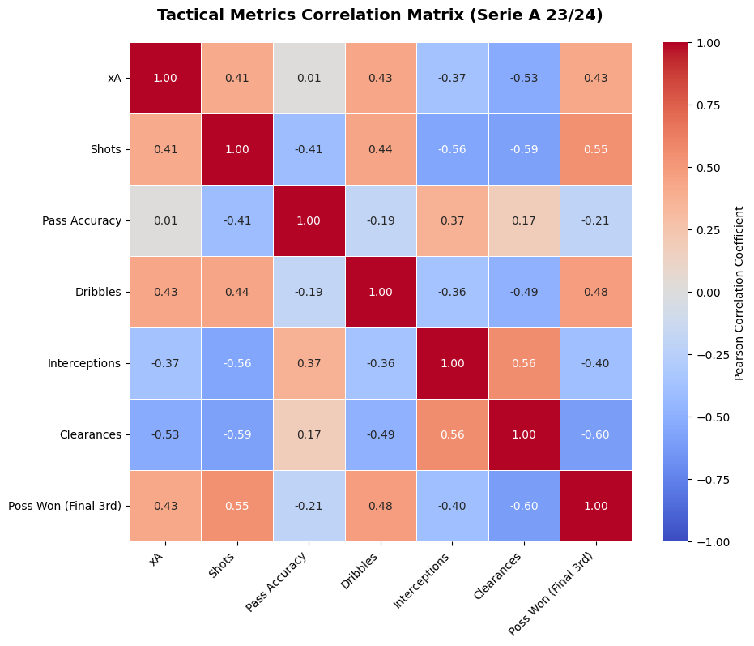
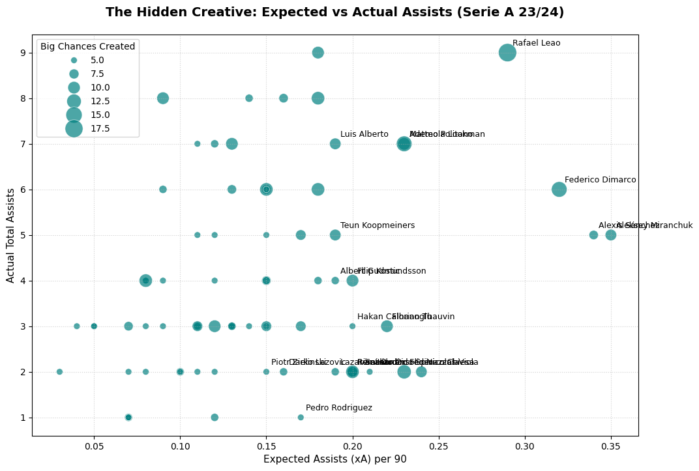
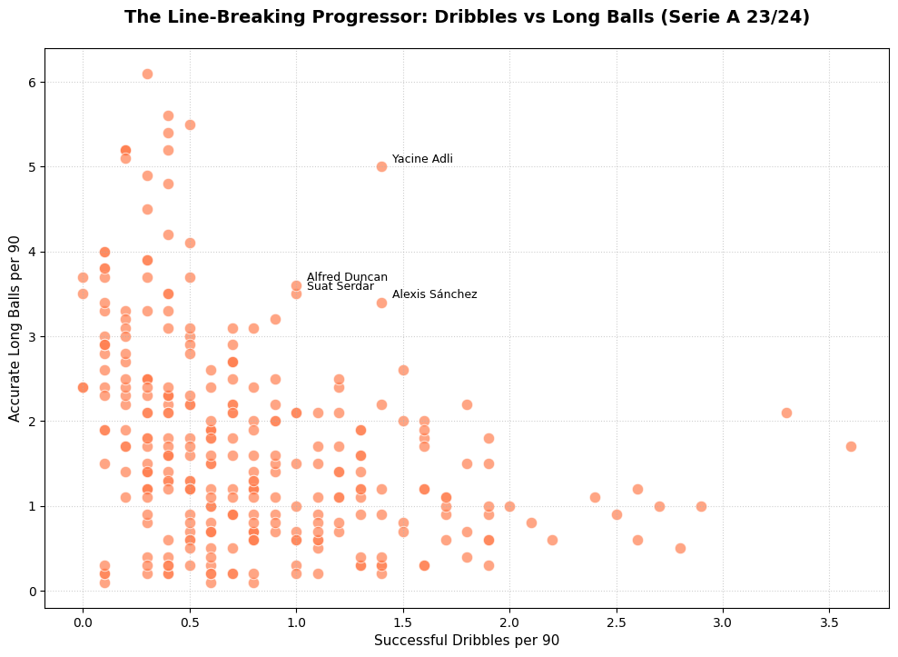
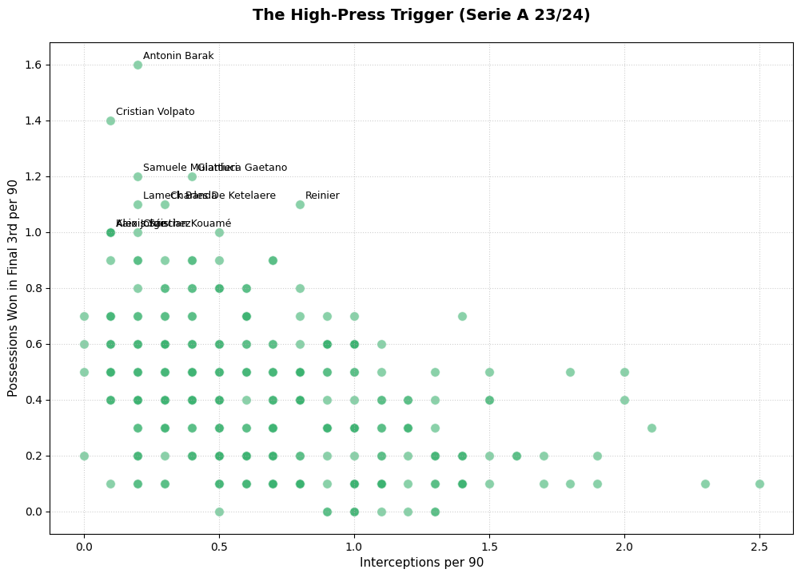
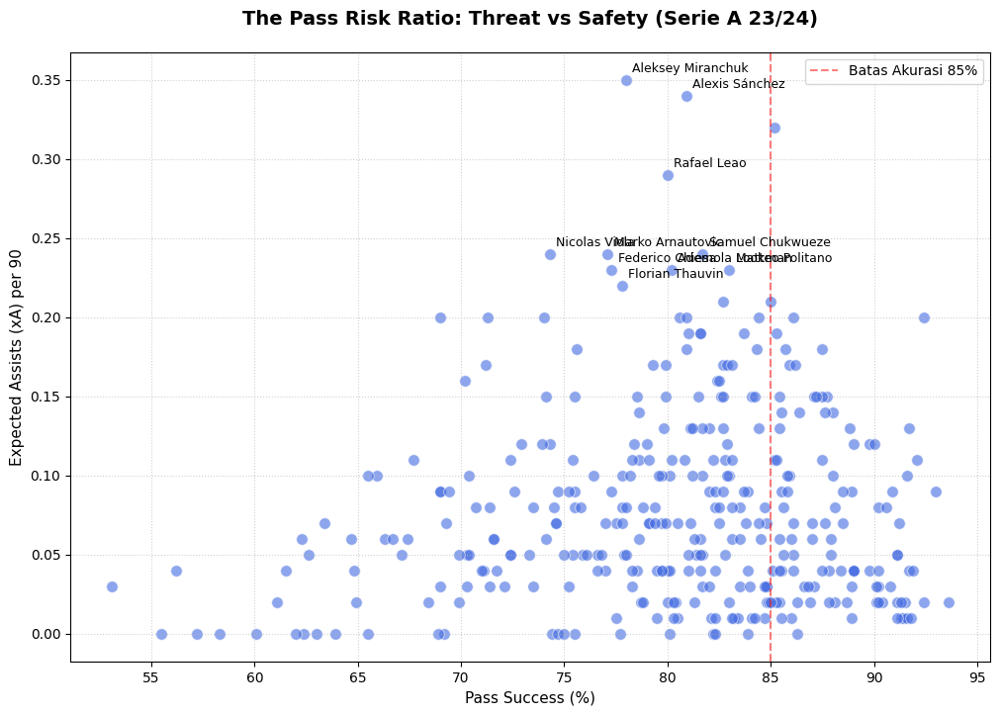
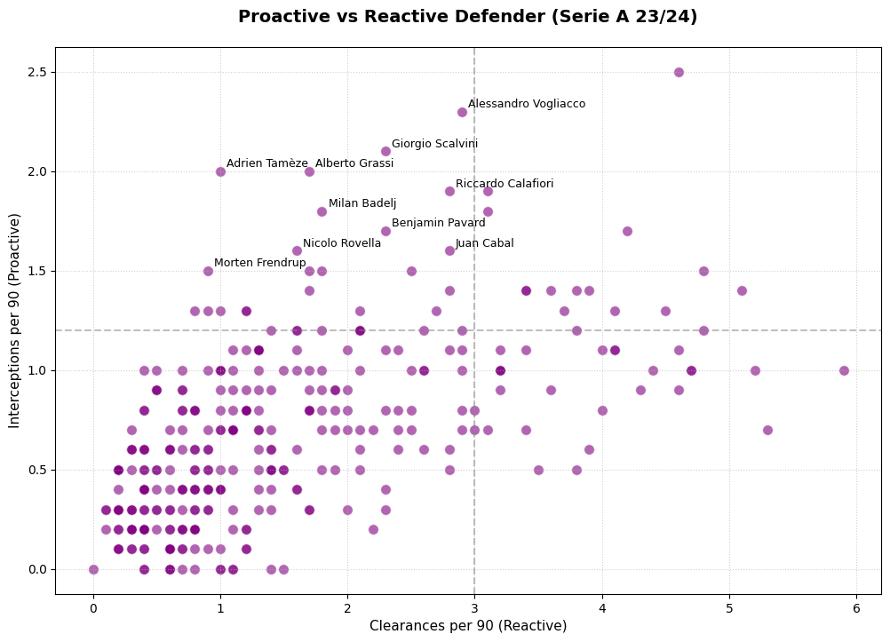
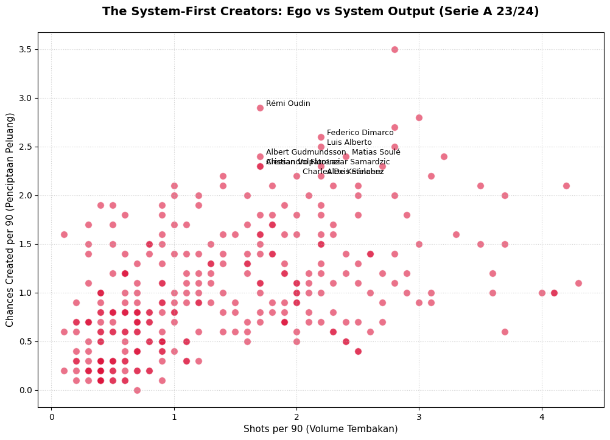

# Advanced Player Metrics & Role Profiling  Serie A 2023/24

A case study exploration of advanced performance metrics for a selected group of Serie A 2023/24 players, segmented into distinct tactical categories (creative outliers, ball progressors, pressing triggers, and defensive profiles). Rather than covering the full league, this project focuses on identifying and explaining standout statistical patterns moving beyond traditional box score stats (goals, assists) toward systemic contribution metrics.

## Objective

Identify and explain standout player patterns using advanced metrics (Expected Assists, ball progression, defensive pressing intensity) to support scouting insight and player evaluation beyond conventional stats.

## Methodology & Tools

- **Data Processing:** Python (Pandas)  extraction, cleaning, and merging of multi-variable player datasets
- **Visualization:** Matplotlib & Seaborn  correlation heatmaps and multi-dimensional scatter plots to surface outliers
- **Key Metrics:** xA (Expected Assists), Big Chances Created, Accurate Long Balls, Possessions Won in Final 3rd, Interceptions, Clearances, shot volume

## Key Insights

**Tactical Metrics Correlation Overview**

**1. The Hidden Creative a creativity vs. finishing gap**
Nicolas Viola (xA 0.24) and Federico Chiesa (xA 0.23) generated high expected-assist values but only 2 actual assists each. This gap signals that the bottleneck is finishing quality from teammates receiving the ball not a lack of creativity or vision from either player.

**2. Line Breaking Progressors**
Yacine Adli led progression metrics with a combination of 1.4 successful dribbles and 5.0 accurate long balls per 90 minutes, standing out as a primary distributor capable of breaking defensive lines through both tight spaces and long-range circulation.

**3. High-Press Triggers**
Antonin Barak (1.6 possessions won in the final third per 90) and Cristian Volpato (1.4) emerged as sharp pressing initiators among the players analyzed  a profile valuable to coaches running aggressive counter-pressing systems.

**4. Risk vs. Reward in passing**
Players like Aleksey Miranchuk and Rafael Leão posted pass accuracy below the conventional 85% benchmark, yet maintained xA above 0.29. Lower final-third pass accuracy here isn't a weakness  it's a byproduct of the high vertical intent needed to break down low-block defenses.

**5. Proactive vs. Reactive defenders**
Comparing interception-to-clearance ratios distinguished defensive styles among the players studied. Alessandro Vogliacco (2.3 interceptions per 90) showed a proactive, read-the-game defensive style anticipating and cutting off attacks early  versus a more conventional reactive approach.

**6. The System-First Creators (Ego vs. System Output)**
Filtering players with low shot volume (<= 2.5 per 90) but high chance creation (>= 1.5 per 90) revealed a specific archetype of unselfish playmakers. Rather than traditional "False 9s", this metric surfaced wide and deep facilitators like Federico Dimarco (Wingback), Luis Alberto (Advanced Playmaker), and Matias Soulé (Inverted Winger). It highlights players who sacrifice personal shooting metrics to operate as the primary creative engines for their respective tactical systems.

## Analytical Value

This category-based approach demonstrates how correlating advanced metrics can surface non-obvious player patterns  such as forwards who facilitate chances rather than take them  useful for scouting undervalued players or profiling opponents ahead of a match.

## Tech Stack

`Python` `Pandas` `Matplotlib` `Seaborn` `Google Colab`

---
*Individual project. Dataset: Serie A 2023/24 player performance data (Kaggle).*
